# Storyboard del lab

## 1. Preparación de librerías COBOL

Se crea una estructura mínima para prácticas COBOL/JCL:

- `IBMUSER.COBOL.SRC`: fuentes COBOL.
- `IBMUSER.COBOL.LOAD`: módulos ejecutables.
- `IBMUSER.ML.JCL`: miembros JCL.

Evidencia:

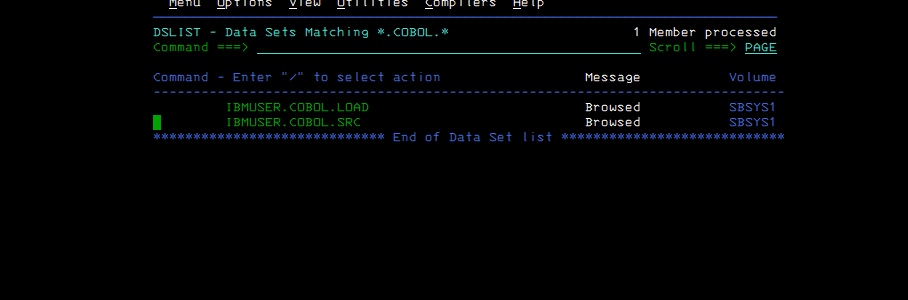

## 2. Primer programa: HELLO

Se crea `IBMUSER.COBOL.SRC(HELLO)` con un programa COBOL mínimo:

```cobol
       IDENTIFICATION DIVISION.
       PROGRAM-ID. HELLO.
       PROCEDURE DIVISION.
           DISPLAY 'WELCOME TO IBMUSER COBOL'.
           STOP RUN.
```

Evidencia:

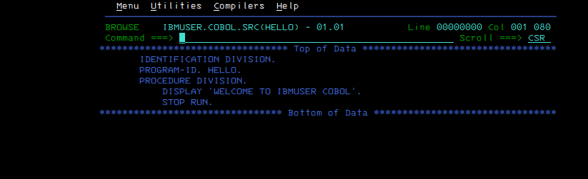

## 3. Compilación HELLO con IGYWCLG

Se usa un JCL tipo Compile + Link + Go.

Punto administrativo importante: la PROC `IGYWCLG` existe, pero fue necesario adaptar el prefijo del compilador a la librería real del sistema:

- Buscado inicialmente por la PROC: `IGY.V4R2M0.SIGYCOMP`.
- Encontrado en el sistema: `IGY420.SIGYCOMP`.
- Corrección usada: `LNGPRFX='IGY420'`.

Evidencias:

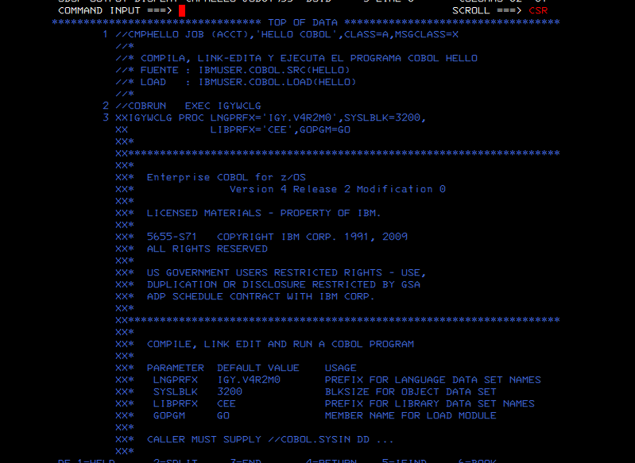

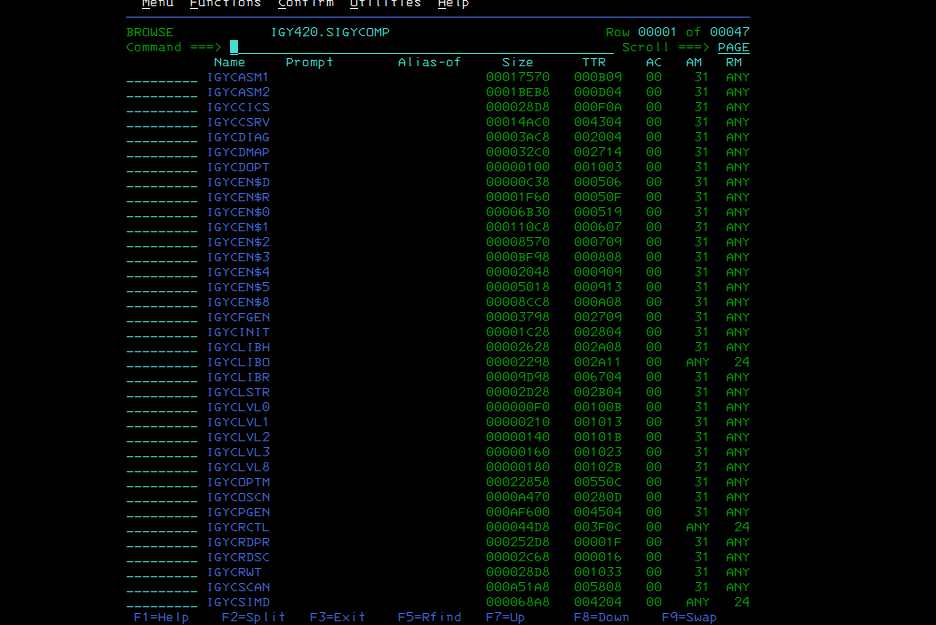

## 4. Diagnósticos reales durante HELLO

Errores encontrados y resueltos:

1. `JOB NOT RUN - JCL ERROR`: error de sintaxis JCL.
2. `STEPLIB - DATA SET NOT FOUND`: la PROC apuntaba a una librería de compilador no existente en este ADCD.
3. `LNGRFX was not used`: parámetro mal escrito; el correcto era `LNGPRFX`.
4. Error de columna 7 COBOL: fuente no respetaba formato fijo.

Evidencias:

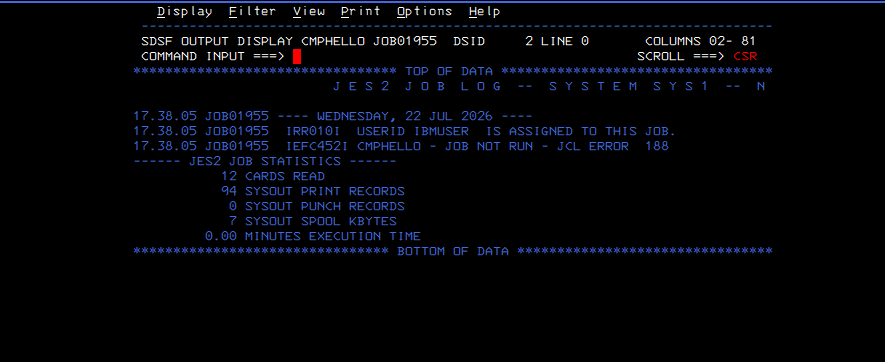

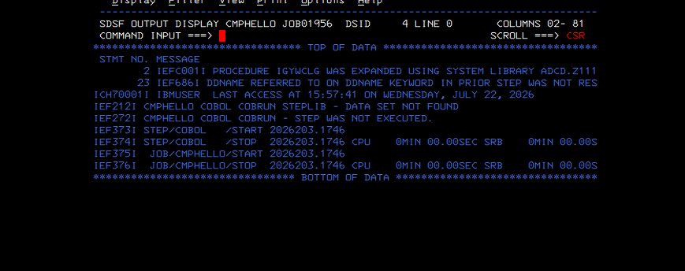

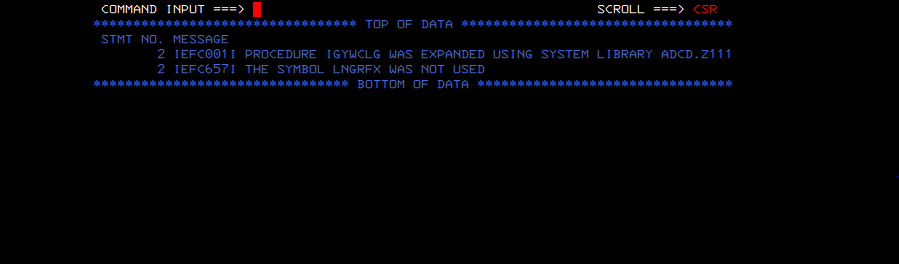

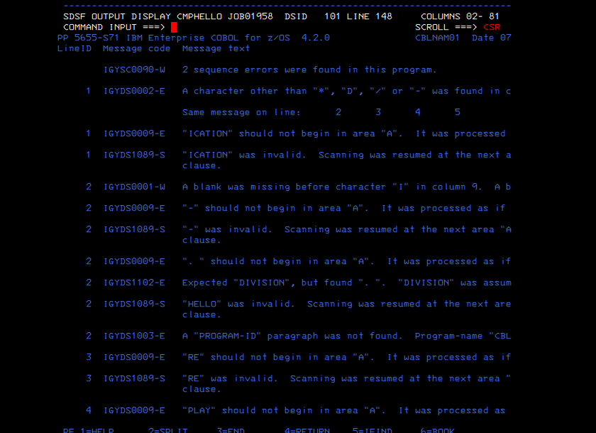

## 5. Compilación y link-edit correctos

Tras corregir JCL, PROC y columnas COBOL, el job llega a condición correcta.

Evidencia:

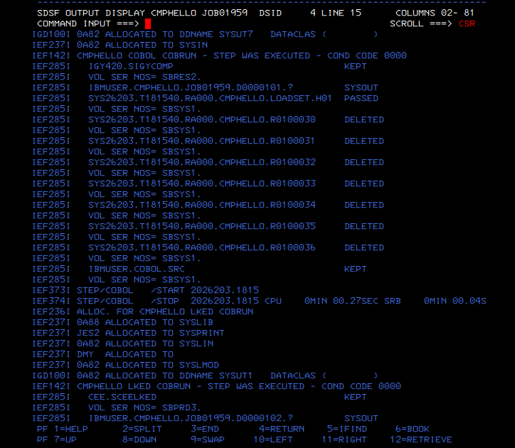

## 6. Segundo programa: PARMES

Se crea `IBMUSER.COBOL.SRC(PARMES)`, que lee una línea desde `SYSIN` y la muestra por `SYSOUT`.

```cobol
       IDENTIFICATION DIVISION.
       PROGRAM-ID. PARMES.
       DATA DIVISION.
       WORKING-STORAGE SECTION.
       01  W-MES                 PIC X(80).
       PROCEDURE DIVISION.
           ACCEPT W-MES.
           DISPLAY W-MES.
           STOP RUN.
```

Evidencia:

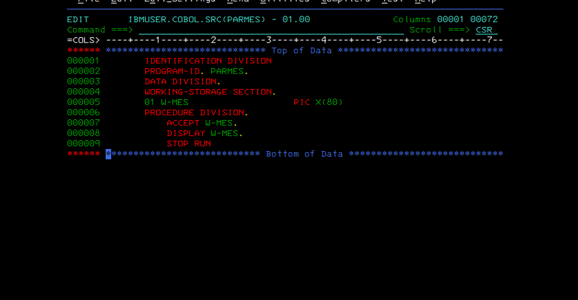

## 7. Compilar y link-editar PARMES

El vídeo separa compilación/link-edit de ejecución. Por eso se usa `IGYWCL`, no `IGYWCLG`.

JCL final limpio:

- `COBOL.SYSIN` apunta al fuente.
- `LKED.SYSLMOD` apunta a la LOADLIB.
- No se ejecuta todavía.

Errores encontrados:

- JCL error por líneas de continuación.
- Confusión inicial con `SYSIN DD DUMMY` dentro de la PROC.
- Solución: simplificar DDs en una línea y dejar el JCL mínimo necesario.

Evidencias:

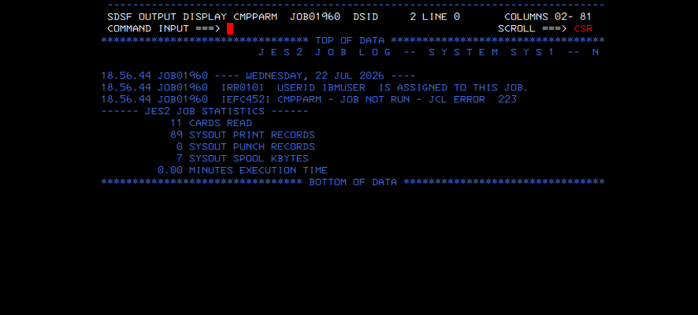

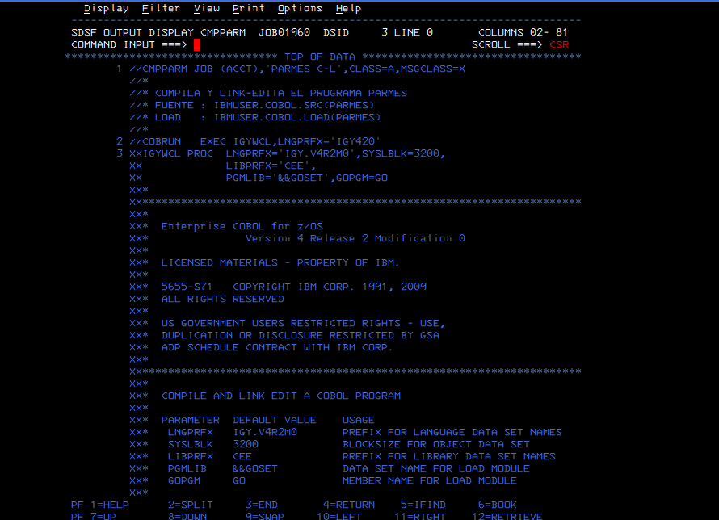

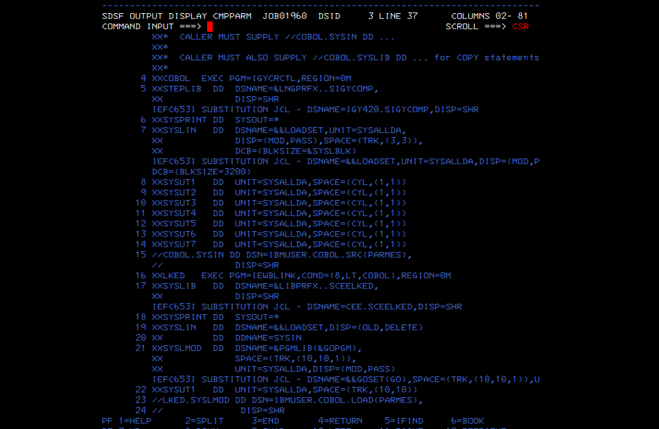

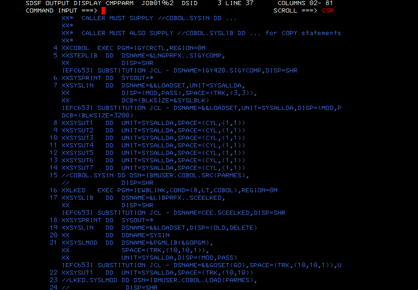

## 8. Ejecutar PARMES con SYSIN/SYSOUT

Se crea `RUNPARM`, que ejecuta el módulo `PARMES` desde `IBMUSER.COBOL.LOAD`.

Entrada por `SYSIN`:

```jcl
//SYSIN DD *
DICIEMBRE
/*
```

Salida esperada por `SYSOUT`:

```text
DICIEMBRE
```

Evidencia:

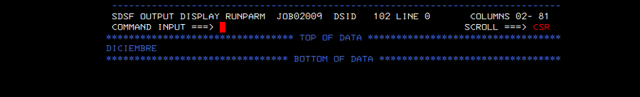

## 9. Estado final del lab

Miembros principales en `IBMUSER.ML.JCL`:

- `CRCOBOL`
- `CMPHELLO`
- `CMPARM`
- `RUNPARM`

Evidencia:

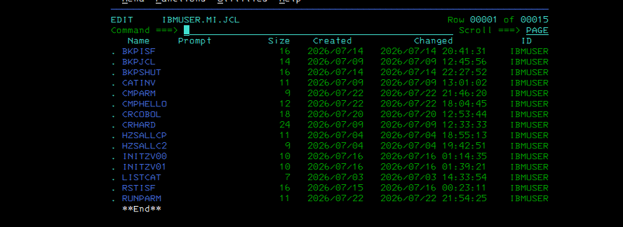
