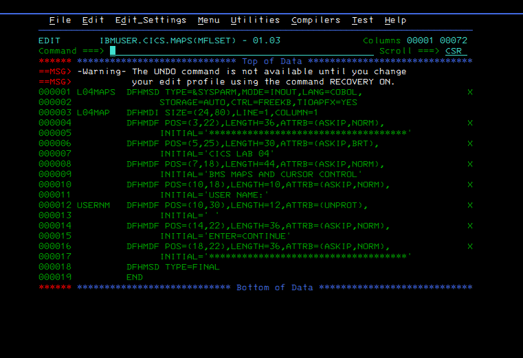
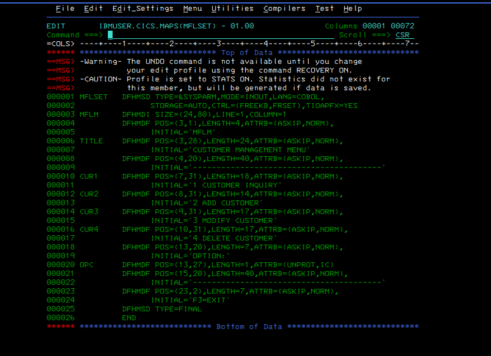
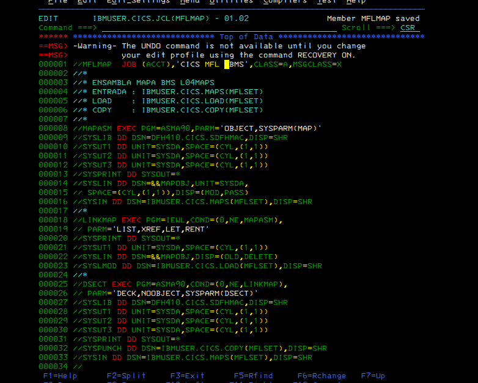
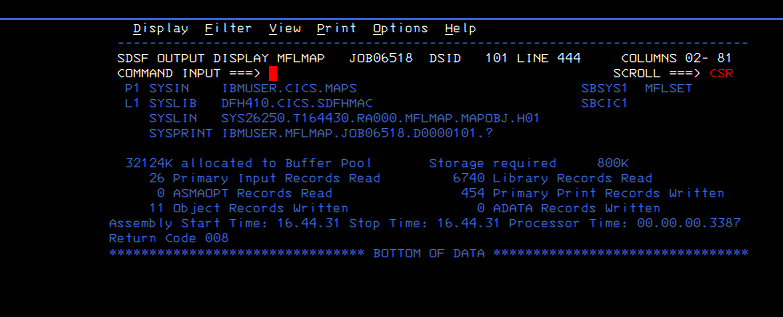

# Lab 01 — Part 1: MFL CICS Application Foundation and BMS Diagnostics

## Objective

Start the **MFL (Mainframe Lab)** CICS application on the existing ADCD z/OS 1.11 environment by reusing the CICS/BMS toolchain already proven in the previous CICS laboratory.

This first part focuses on:

- identifying and reusing the existing CICS datasets and BMS build process;
- defining the first MFL BMS mapset and menu map;
- adapting the proven `L04MAP` build JCL into `MFLMAP`;
- executing the BMS assembly process under CICS TS 4.1;
- diagnosing real HLASM fixed-format continuation errors through SDSF;
- stopping at a documented and reproducible diagnostic checkpoint.

This part does **not** claim a successful BMS generation yet. The current checkpoint ends with `RC=0008` and the remaining work is intentionally carried into Part 2.

## Scope

The practical sequence follows the training material used for the MFL application introduction while adapting names and resources to this laboratory.

The application prefix used in this repository is:

```text
MFL = Mainframe Lab
```

The first planned menu map contains:

```text
MFLM
CUSTOMER MANAGEMENT MENU

1 CUSTOMER INQUIRY
2 ADD CUSTOMER
3 MODIFY CUSTOMER
4 DELETE CUSTOMER

OPTION:

F3=EXIT
```

## Environment

| Component | Value |
|---|---|
| Platform | ADCD z/OS 1.11 |
| CICS region | `CICSA` |
| CICS version | CICS TS 4.1 |
| User | `IBMUSER` |
| BMS source library | `IBMUSER.CICS.MAPS` |
| Symbolic map library | `IBMUSER.CICS.COPY` |
| Load library | `IBMUSER.CICS.LOAD` |
| JCL library | `IBMUSER.CICS.JCL` |
| COBOL source library | `IBMUSER.CICS.SRC` |
| Assembler | `ASMA90` |
| CICS macro library | `DFH410.CICS.SDFHMAC` |
| Link editor | `IEWL` |

## Reuse Strategy

A key engineering decision in this lab is **not to rediscover or redesign infrastructure that has already been proven on the same system**.

The existing CICS Lab 04 resources provide the validated reference pattern:

```text
IBMUSER.CICS.MAPS(L04MAPS)
IBMUSER.CICS.JCL(L04MAP)
IBMUSER.CICS.COPY(L04MAPS)
IBMUSER.CICS.LOAD(L04MAPS)
```

Inside the original BMS source:

```text
L04MAPS = mapset
L04MAP  = map
```

For MFL, the equivalent naming is:

```text
MFLSET = mapset
MFLM   = map
```

The proven `L04MAPS` member is therefore retained as the formatting and build reference for the continuation work that will continue in Part 2.

## Dataset Roles

```text
IBMUSER.CICS.MAPS
    BMS source members

IBMUSER.CICS.COPY
    symbolic map / DSECT output

IBMUSER.CICS.LOAD
    physical map load modules

IBMUSER.CICS.JCL
    assembly/link/DSECT generation jobs

IBMUSER.CICS.SRC
    future CICS application programs
```

The existing datasets were inspected before starting the build and were reused rather than creating unnecessary new libraries.

## MFL Resources

The MFL application foundation established in this part is:

```text
Mapset : MFLSET
Map    : MFLM
Input  : OPC
JCL    : MFLMAP
```

The BMS source is stored on z/OS as:

```text
IBMUSER.CICS.MAPS(MFLSET)
```

The build JCL is stored as:

```text
IBMUSER.CICS.JCL(MFLMAP)
```

## BMS Structure

The mapset uses the same basic BMS hierarchy already validated in the earlier CICS lab:

```text
DFHMSD  -> mapset definition
DFHMDI  -> map definition
DFHMDF  -> field definitions
```

The mapset definition uses:

```text
TYPE=&SYSPARM
MODE=INOUT
LANG=COBOL
STORAGE=AUTO
CTRL=(FREEKB,FRSET)
TIOAPFX=YES
```

`TYPE=&SYSPARM` allows the same BMS source to be processed in two modes from the JCL:

```text
SYSPARM(MAP)    -> physical map
SYSPARM(DSECT)  -> symbolic map
```

## Menu Design

The first MFL menu is intentionally simple.

Protected output fields use:

```text
ATTRB=(ASKIP,NORM)
```

The option field uses:

```text
OPC      DFHMDF ...
         ATTRB=(UNPROT,IC)
```

This makes `OPC` the editable field and initially places the cursor there.

No `RECEIVE MAP`, business logic, transaction definition, or COBOL CICS program is implemented in Part 1.

## Build JCL

`IBMUSER.CICS.JCL(MFLMAP)` was created from the already proven `L04MAP` JCL rather than from a new build procedure.

The job contains three stages.

### 1. MAPASM

```text
PGM=ASMA90
PARM='OBJECT,SYSPARM(MAP)'
```

Input:

```text
IBMUSER.CICS.MAPS(MFLSET)
```

CICS macros:

```text
DFH410.CICS.SDFHMAC
```

Temporary object:

```text
&&MAPOBJ
```

### 2. LINKMAP

```text
PGM=IEWL
PARM='LIST,XREF,LET,RENT'
```

Expected output:

```text
IBMUSER.CICS.LOAD(MFLSET)
```

### 3. DSECT

```text
PGM=ASMA90
PARM='DECK,NOBJECT,SYSPARM(DSECT)'
```

Expected symbolic output:

```text
IBMUSER.CICS.COPY(MFLSET)
```

## Execution and Diagnostic History

This part intentionally preserves the failed attempts because they demonstrate the actual fixed-format BMS/HLASM troubleshooting process.

### Attempt 1 — RC=0012

The first build produced multiple HLASM errors.

Typical diagnostics included:

```text
ASMA431W Continuation statement may be in error
ASMA141E Bad character in operation code
```

Lines such as:

```text
MODE=INOUT
LANG=COBOL
STORAGE=AUTO
LENGTH=...
ATTRB=...
INITIAL=...
```

were being interpreted as new assembler operations rather than continuations of `DFHMSD`, `DFHMDI`, or `DFHMDF`.

This established that the logical BMS content was not the only issue: **physical fixed-format record layout matters**.

### Attempt 2 — RC=0004

After adding continuation indicators, the assembler progressed significantly further.

This was an important diagnostic milestone:

```text
RC=0012 -> RC=0004
```

However, the build was still not clean and later steps were prevented from completing by the JCL condition logic.

### Attempt 3 — RC=0008

Further continuation changes resulted in:

```text
RC=0008
```

The remaining diagnostics still point to fixed-format continuation placement.

At this point the decision was made to stop changing the layout heuristically and instead use the previously successful `L04MAPS` source as the exact formatting reference.

## Fixed-Format Lesson

For this environment, a BMS macro that continues onto another physical record must respect HLASM fixed-format rules.

The validated reference member shows continuation markers in column 72.

The continuation work therefore follows this rule:

```text
columns 1-71 : assembler/BMS statement
column 72    : continuation indicator (X in the proven source)
next record  : continuation operand begins in the correct operand area
```

A comma in the macro operand list is **not by itself** a physical continuation indicator.

This distinction explains the early `ASMA141E` cascade.

## Evidence

### Existing successful BMS formatting reference



This screenshot is important because it shows the BMS member that had already been successfully assembled on this system, including the continuation pattern.

### MFL source under column inspection



`COLS` was enabled in ISPF to inspect the physical record layout and column 72.

### Adapted MFL build JCL



The JCL reuses the same `ASMA90 -> IEWL -> ASMA90` flow proven in the previous lab and points to `MFLSET`.

### Current diagnostic checkpoint



The current Part 1 checkpoint is `RC=0008`. This is documented as an unresolved diagnostic state, not as a successful build.

## What Was Learned

Part 1 establishes several practical lessons:

- reuse a toolchain already proven on the target z/OS image;
- distinguish a BMS **mapset** from an individual **map**;
- understand physical versus symbolic BMS generation;
- use `SYSPARM(MAP)` and `SYSPARM(DSECT)` with one source;
- inspect real assembler diagnostics in SDSF;
- understand that BMS source is still subject to HLASM fixed-format rules;
- avoid repeatedly redesigning a working pattern when a validated local reference already exists;
- preserve failed builds as engineering evidence instead of hiding them.

## Current Status

```text
MFL application naming                  COMPLETE
Existing CICS datasets identified       COMPLETE
Existing BMS build toolchain reused     COMPLETE
MFLSET/MFLM structure established       COMPLETE
MFLMAP JCL adapted                      COMPLETE
First MAPASM execution                  COMPLETE
SDSF diagnostics collected              COMPLETE
Fixed-format continuation diagnosis     COMPLETE
Clean MAPASM RC=0000                    PENDING
LINKMAP validation                      PENDING
DSECT validation                        PENDING
CICS runtime installation               NOT STARTED
COBOL SEND/RECEIVE logic                NOT STARTED
```

## Part 1 Checkpoint

Part 1 is closed at a controlled diagnostic boundary.

The most recent generation attempt ends at:

```text
MAPASM -> RC=0008
```

The remaining issue is associated with fixed-format continuation layout. The next session will resume by comparing `MFLSET` directly against the proven `L04MAPS` physical formatting instead of introducing a different BMS layout.

## Part 2 — Planned Continuation

Part 2 will start exactly from this checkpoint:

1. keep `L04MAPS` unchanged as the validated formatting reference;
2. align `MFLSET` continuation columns to that reference;
3. perform a preventive source review before submission;
4. submit `MFLMAP`;
5. obtain `MAPASM RC=0000`;
6. validate `LINKMAP`;
7. validate DSECT generation;
8. verify `IBMUSER.CICS.LOAD(MFLSET)`;
9. verify `IBMUSER.CICS.COPY(MFLSET)`;
10. only then continue with the next application stage.

## Engineering Methodology

```text
Build -> Execute -> Observe -> Diagnose -> Correct -> Validate -> Document
```

Part 1 deliberately ends after `Diagnose` / controlled `Correct` iterations because the final validation is still pending.

## Security and Publication Notes

The evidence selected for this part is limited to z/OS/ISPF/CICS development screens.

Before publication, the installation commands include a repository scan for:

- private IPv4 address patterns;
- MAC address patterns.

Host network identifiers must not be published in this repository.

## Repository Structure

```text
labs/01-cics-mfl-application-part-1/
├── README.md
├── bms/
│   └── MFLSET.bms
├── jcl/
│   └── MFLMAP.jcl
├── docs/
│   ├── 01-build-flow.md
│   └── 02-diagnostic-checkpoint.md
├── commands/
│   └── gitbash-install-and-push.sh
└── evidence/
    ├── README.md
    └── screenshots/
        ├── 01-l04maps-proven-fixed-format-reference.png
        ├── 02-mflset-cols-continuation-work.png
        ├── 03-mflmap-jcl.png
        └── 04-mflmap-rc0008.png
```

---

## Part of the z/OS Engineering Laboratory

This lab belongs to the wider ADCD z/OS engineering portfolio and follows the same evidence-driven methodology used across the repository.


---
### Continue learning

**Previous:** Course introduction  
**Course:** [Course home](../../README.md)  
**Next:** [05-file-transfer-pc-zos-data-preparation](../05-file-transfer-pc-zos-data-preparation/)  
**Academy:** [z/OS Engineering Academy](https://github.com/P-dot/P-dot/blob/main/docs/ACADEMY.md) · [Curriculum](https://github.com/P-dot/P-dot/blob/main/docs/CURRICULUM.md)
